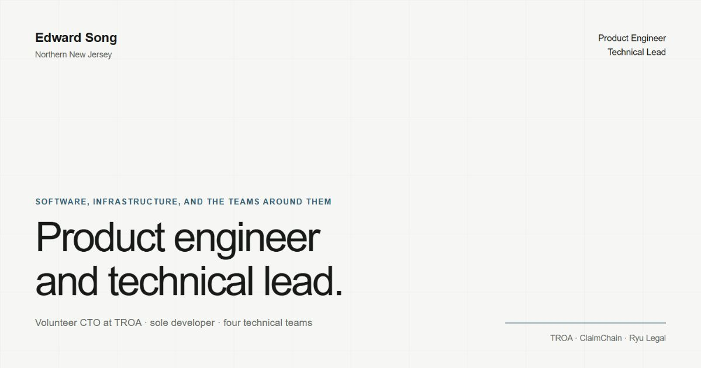

# Edward Song — Product Engineering Portfolio



Source for [Edward Song's portfolio](https://final-profile-chi.vercel.app/), presenting selected product engineering, systems work, technical leadership, and production delivery.

## What this portfolio demonstrates

- Product and systems direction across ambiguous, workflow-heavy problems
- Hands-on application engineering spanning interfaces, services, data, and integrations
- Security and operational controls including validation, server authority, RBAC/RLS, and audit history
- Technical leadership across software, UI/UX, network engineering, and IT operations

## Selected case studies

| Work | Scope | Evidence |
| --- | --- | --- |
| TROA | Board-level direction, product engineering, and multidisciplinary leadership for a 50-plus-volunteer, 800-plus-member community | [Read case study](https://final-profile-chi.vercel.app/work/troa) |
| ClaimChain | Governed multi-role workflows, deterministic scoring, advisory ML, test payments, and entitled export | [Read case study](https://final-profile-chi.vercel.app/work/claimchain) |
| Ryu Legal | Long-term requirements, design, engineering, deployment, search visibility, and maintenance for a production client site | [Read case study](https://final-profile-chi.vercel.app/work/ryu-legal) |

## Stack

- Next.js Pages Router, React, TypeScript, and Tailwind CSS
- Framer Motion and next-themes
- OGL-powered interactive visual treatment
- Resend for contact-form delivery
- Vercel deployment

## Local development

Use Node.js 20.9 or later (Node 22 is used in CI).

```bash
npm ci
npm run dev
```

Create `.env.local` with the Resend API key required by the contact route:

```env
RESEND_API_KEY=re_your_key_here
```

Never commit `.env.local` or any production key.

## Quality checks

```bash
npm run lint
npm run typecheck
npm run test:unit
npm run build
npm audit --omit=dev --audit-level=high
```

`npm test` runs linting, type-checking, and unit tests together. GitHub Actions runs the full suite, including the production build and dependency audit, on pull requests and updates to `master`.

## Contact form safeguards

The `/api/contact` route validates and limits request bodies server-side, escapes email HTML, uses a honeypot, verifies same-origin browser requests, and applies an in-memory per-instance rate limit. The rate limit is intentionally a baseline; add a durable shared limiter (for example, Vercel Firewall plus a managed Redis/KV service) before expecting protection across multiple serverless instances or sustained abuse.

## SEO and deployment

The production URL is `https://www.edsong.xyz/`. The project ships a canonical URL, Open Graph/Twitter metadata, JSON-LD profile data, `robots.txt`, `sitemap.xml`, favicon, and baseline security headers. Deploy through the connected Vercel project after CI passes.
